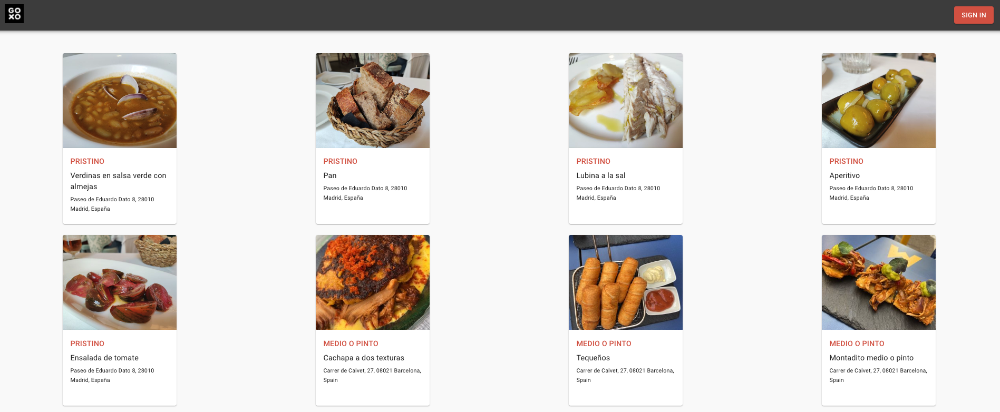
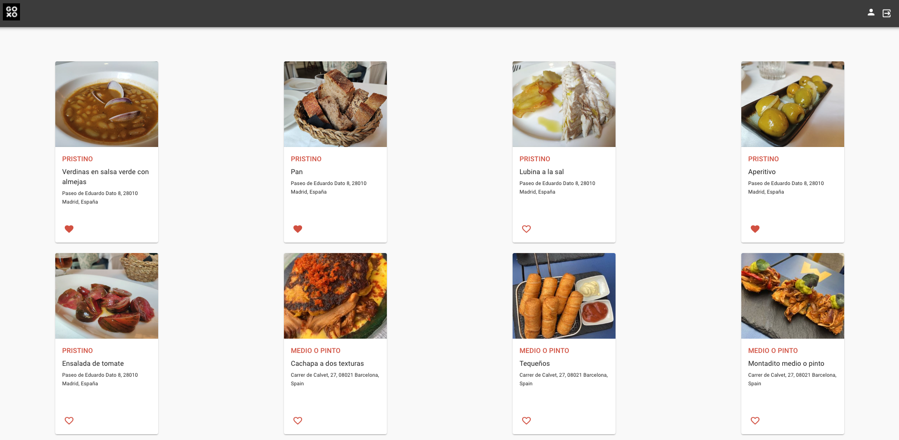
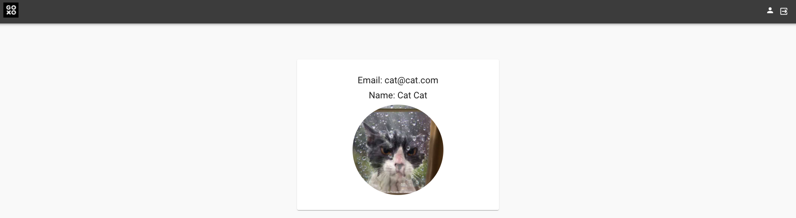

# Challenge for Goxo

## Challenge description

Web app with a login form whose data must be accessible for the user

## Solution

### Homepage

The homepage presents available dishes. Data is fetched from a Mongo database. Dish images are hosted in Cloudinary.



If the user is logged in, a favorite icon will be displayed for every dish. User can click on this icon to add or remove dish from favorites.



The user is saved in a React Context.

### Sign up form

An email, a name and a picture (optional) are requested, as well as a password, which must be introduced twice.

### Sign in form

Only the email and password are required.

## Profile page

Here the user can access their data from the sign up form (except for the password)



## Install

Clone this repo and open a terminal:

```bash
cd client
npm install
cd ../server
npm install
```

### Environment variables

Create a .env file inside the server directory and declare the environment variables needed for this project:

DOMAIN=http://localhost:3000

MONGODB_URI=mongodb://localhost/goxo

SESSION_SECRET=\<your-session-secret\>

PORT=5000

CLOUDINARY_NAME=\<your-cloudinary-name\>

CLOUDINARY_KEY=\<your-cloudinary-key\>

CLOUDINARY_SECRET=\<your-cloudinary-secret\>

The cloudinary variables are needed for uploading user images. If you don't want to upload images, give this variables any value.

### Db seeding

This project uses a MongoDB database.

In server/src/bin there is a seeds.ts for seeding your local database.

Open a terminal, go to root directory of the project and execute:

```bash
npm run seed
npm install
```

This will seed the DB with the Restaurants. Then, open the seeds.ts, comment the Restaurants part and uncomment the Dishes part.
Seed the database again by running:

```bash
npm run seed
npm install
```

The dishes will also be seeded.

## Usage

Open two terminals (one for the server side and another one for the client side)

- Server

```bash
cd server
npm build
npm start
```

- Client

```bash
cd client
npm start
```

## Author

Bárbara Díaz

- Github: [@barbarad91](https://github.com/barbarad91)
- LinkedIn: [barbaradiazduran](https://www.linkedin.com/in/barbaradiazduran/)
- Twitter: [@barbarad91](https://twitter.com/barbarad91)
